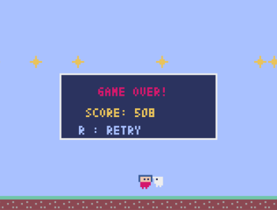

# pyxel: レトロゲームプログラミング体験!!

## ゲームの仕組み


- ゲームは アニメのパラパラ漫画と同じ！速くめくると動いて見える!
  - ゲームは1秒間に30回、以下のサイクルを猛スピードで繰り返しています。
  - 「状態を更新（update）」：頭脳のフェーズ
    - キー入力の受け付け、キャラクターの移動、当たり判定の計算を行います。
  - 「画面を描く（draw）」：見た目のフェーズ
    - 前の画面を一度真っさらにしてから、新しい位置に描き直します。
    - playerの位置を毎回計算して、画面上のどこに表示するかを決定して、表示している
- プログラムの中にある数字を変えるだけで、ゲームの世界の物理法則を書き換えることができる！
- キャラクターが何かにあたったかどうかを判定するロジックは、キャラクターと対象物で重なっているところがあるかで判定します。

## 改造タイム
**[注意]**  コードを変更したら、一度ゲームを終了して再起動しましょう。
- ファイルを変更したら、一度ゲームを終了して再起動て動作を確認してよう。
プログラミングは、まずは自分のくわえた変更によって、どのように動きが変わるかを確認する作業を繰り返すのが上達の一歩です。

### 【レベル1】ゲームバランスを支配する（難易度：★☆☆）
ファイル冒頭にある「定数」の数字を書き換えて動作を確認してみましょう
- MOVE_SPEED: キャラクターの移動速度（10くらいにすると爆速に！）
- JUMP_POWER: ジャンプの高さ（マイナスの値を大きくすると空まで飛べる！）
- GRAVITY: 重力の強さ（大きくすると、ジャンプしてもすぐ落ちる「超重力」の世界に）
- ENEMY_INTERVAL: 敵が出る間隔（小さくすると敵が画面を埋め尽くす！）


### 【レベル2】「スコア」を表示する（難易度：★★☆）

- update() の中に self.score += 1 の処理で生き残るほどスコアが増えるようになっています
- draw() の中に pyxel.text(...) を追加して、画面にスコアを表示させてみましょう

```python
# update() 
self.score += 1

# draw() の中に追加
pyxel.text(5, 5, f"SCORE: {self.score}", 7)
```

### 【レベル3】自分だけの世界観を作る（難易度：★★★）
- 色の変更をしてみよう
  -  pyxel.cls(色番号) で背景の色を自分の好きな色に変えてみましょう
- 演出の追加をしてみよう
  - ゲームオーバー時に「GAME OVER」だけでなく、自分なりのメッセージを出すように書き換えてみましょう
- キャラクターを自分で作成してみましょう
  - my_resource.pyxres でビット絵を変更してみましょう





