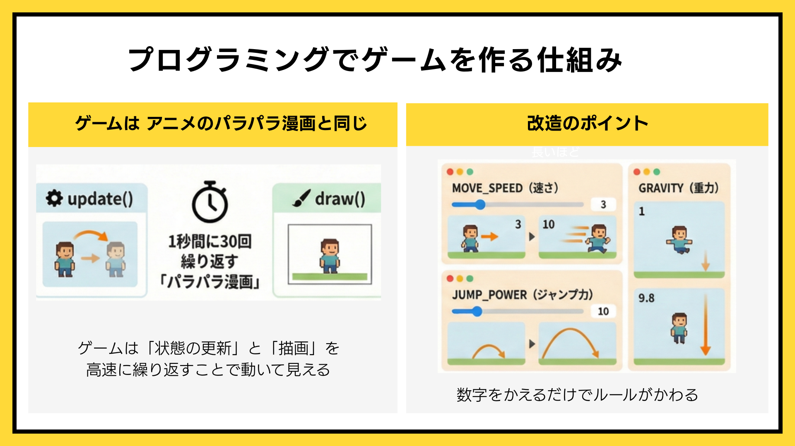
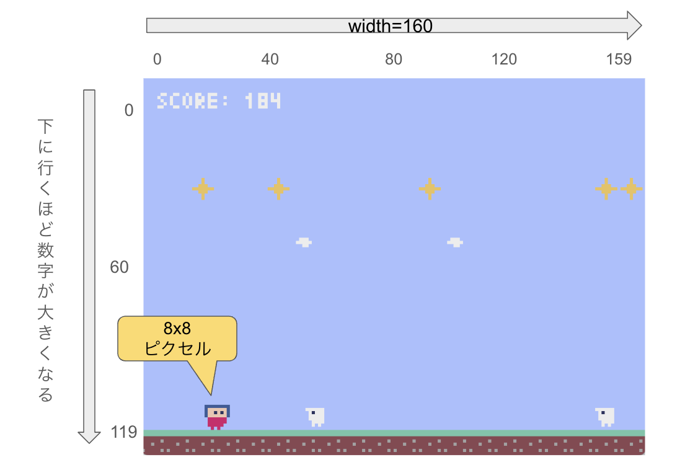

# pyxel: レトロゲームプログラミング体験!!

## ゲームの遊び方
```
 左・右矢印キー: 左右に移動
 スペースキー： ジャンプ

 上部にある▶️　ボタンを押してゲームを立ち上げよう！
 ```

## ゲームが動く仕組み


ゲームは、アニメのパラパラ漫画と同じ仕組みです！
　
## 改造タイム
プログラミングの上達の秘訣は、**「変更 → 実行 → 動作検証」の繰り返し** です！

1. ソースコードを変更する
2. ゲームを終了する（Escキー）
3. 上部にある▶️　ボタンを押してゲームを再起動して確認してみよう



### 【レベル1】スピードを変える（難易度：★☆☆）
キャラクターや敵のスピードを変えてみましょう！
- MOVE_SPEED: キャラクターの移動速度
- ENEMY_SPEED: 敵の移動速さ
- ENEMY_INTERVAL: 敵が出る間隔

### 【レベル2】ジャンプの高さを変える（難易度：★★☆）
- JUMP_POWER: ジャンプの高さ
- GRAVITY: 重力の強さ

### さらに挑戦したい人へ （難易度：★★★）
キャラクターを自分で作ってみましょう

```bash
pyxel edit my_resource.pyxres
```
